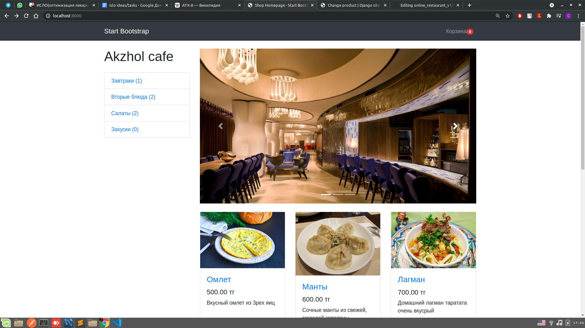

<!-- PROJECT SHIELDS -->

[![Contributors][contributors-shield]][contributors-url]
[![Forks][forks-shield]][forks-url]
[![Stargazers][stars-shield]][stars-url]
[![Issues][issues-shield]][issues-url]
[![MIT License][license-shield]][license-url]
[![LinkedIn][linkedin-shield]][linkedin-url]


<!-- PROJECT LOGO -->
<br />
<p align="center">
  <a href="https://github.com/othneildrew/Best-README-Template">
    
  </a>

  <h3 align="center"> AKZHOL restaurant site</h3>


</p>



<!-- TABLE OF CONTENTS -->
<details open="open">
  <summary>Table of Contents</summary>
  <ol>
    <li>
      <a href="#about-the-project">About The Project</a>
      <ul>
        <li><a href="#built-with">Built With</a></li>
      </ul>
    </li>
    <li>
      <a href="#getting-started">Getting Started</a>
      <ul>
        <li><a href="#prerequisites">Prerequisites</a></li>
        <li><a href="#installation">Installation</a></li>
      </ul>
    </li>
    
  </ol>
</details>


<!-- ABOUT THE PROJECT -->
## About The Project

[![Product Name Screen Shot][product-screenshot]](https://github.com/sayatbekbolat/online_restaurant_v1/blob/main/media/restaurant_site.jpeg)

The site respresents the restautant's official information and contant. Akzhol is a Eastern cuisine restautant in Ushtobe town in Almaty Region, Kazakhstan.   

### Built With

The site have been developed using by Django - framework. The HTML template copied from Bootstrap v4
* [Bootstrap](https://getbootstrap.com)
* [Python3](https://www.python.org/download/releases/3.0/)
* [Django](https://www.djangoproject.com/)


<!-- GETTING STARTED -->
## Getting Started

Use conda env to create an environment for the project. Install python, django, Pillow libs. Upgrade your manager - pip 

### Prerequisites


* pip
  ```sh
    python -m pip install –upgrade pip
  ```

### Installation

1. Clone the repo
   ```sh
   git clone https://github.com/sayatbekbolat/online_restaurant_v1.git
   ```
2. Install PIP packages
   ```sh
   pip install -r req.txt
   ```
### RUN


1. run server
   ```sh
   python manage.py runserver
   ```
